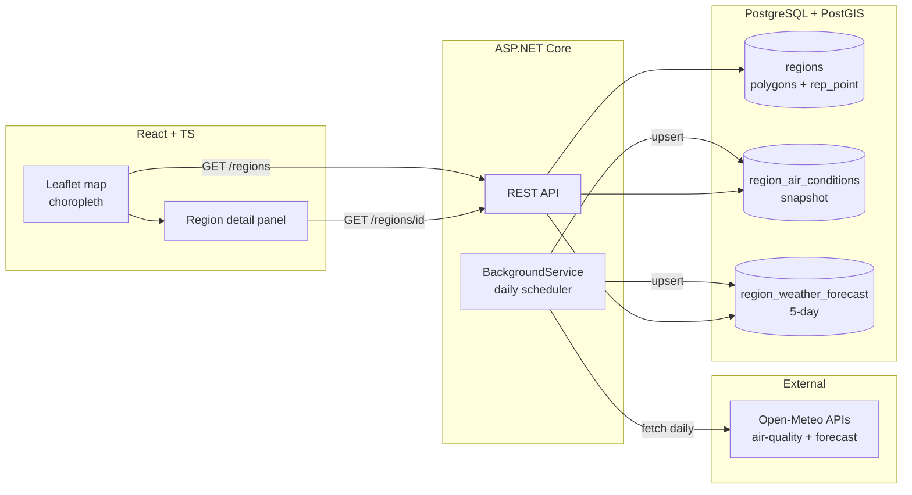
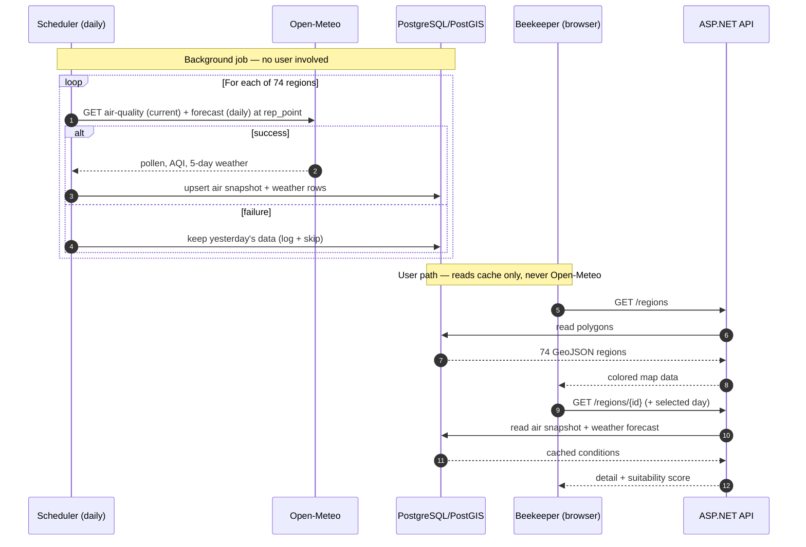

# 🐝 Thesis Project Brief: "Pollinator" - Apiary Placement Decision-Support Platform

---

## 📋 Executive Summary

| Attribute | Detail |
|-----------|--------|
| **Thesis Title** | Web-Based Geospatial System for Optimal Apiary Placement Using Real-Time Pollen Data |
| **Core Purpose** | A decision-support tool that shows beekeepers regional pollen, air-quality, and weather conditions across Greece to help them choose where (and when) to place hives |
| **Primary User** | Beekeepers |
| **Geographic Unit** | **74 regional units** of Greece (NUTS3 level), nationwide |
| **Health-Informatics Basis** | Pollen indices + air-quality indices presented at region level |
| **Thesis Emphasis** | Geospatial integration, PostGIS querying, a scheduled data-ingestion pipeline (caching), and explainable scoring |

---

## 🎯 Functional Scope (Strict Boundaries)

### ✅ In-Scope
1. User registration & login
2. Nationwide map of the 74 regional units as colored GeoJSON polygons (choropleth)
3. Metric toggle: recolor regions by **air quality**, **pollen**, or **temperature**
4. Region detail view: current pollen + current air quality + selected-day weather
5. Day selector (today + next 4 days) affecting the **weather** view only
6. Explainable suitability score per region (transparent formula)

---

## 🧰 Tech Stack

| Layer | Technology |
|-------|-----------|
| **Frontend** | React + TypeScript, Leaflet (via react-leaflet), OpenStreetMap tiles |
| **Backend** | ASP.NET Core Web API (REST), C# |
| **Scheduler** | ASP.NET Core `BackgroundService` (built-in) |
| **Database** | PostgreSQL + PostGIS (local Docker) |
| **External Data** | Open-Meteo Air Quality API (`/v1/air-quality`) + Weather Forecast API (`/v1/forecast`) |
| **Geo Data** | 74 regional-unit polygons (open GeoJSON, EPSG:4326 / WGS84), imported once |

---

## 🗄️ Data & Geospatial Architecture

### Data Sources
- **Region borders:** open GeoJSON of the 74 regional units (NUTS3), EPSG:4326.
- **Representative point per region:** computed in PostGIS with `ST_PointOnSurface(geom)` — a point guaranteed to fall *inside* each polygon. This point is what we send to Open-Meteo.
- **Conditions data:** Open-Meteo (two endpoints), fetched by the scheduler only.

### Storage (conceptual)
```
PostgreSQL + PostGIS (Docker-local)
├── users                  : beekeeper profiles
├── regions                : region_id, name, geom (POLYGON/MULTIPOLYGON), rep_point (POINT)
├── region_air_conditions  : region_id (PK), pollen + pollutant snapshot, fetched_at
│                            → ~74 rows, one per region, OVERWRITTEN daily
├── region_weather_forecast: region_id + forecast_date (composite key),
│                            temp/wind/rain/weather_code, fetched_at
│                            → ~74 × 5 ≈ 370 rows, upcoming days overwritten daily
└── Spatial index          : GiST on regions.geom
```

> **Why two tables:** pollen/air are stored as a single *current snapshot* per region (no meaningful day-to-day variation at regional scale). Weather is stored as a *5-day forecast* per region because the day-to-day difference is real and drives the "which day to place hives" decision.

### Open-Meteo Parameters

**Air Quality API — fetched with `&current=` (snapshot):**

| Group | Core parameters | Optional |
|-------|----------------|----------|
| Pollen (Grains/m³) | `grass_pollen`, `olive_pollen` (key for Greece), `birch_pollen` | `alder_pollen`, `mugwort_pollen`, `ragweed_pollen` |
| Air pollutants | `pm2_5`, `pm10`, `european_aqi` (headline 0–100+ banded index) | `ozone`, `nitrogen_dioxide` |

> ⚠️ **Pollen is Europe-only and seasonal** (≈4-day window during pollen season). Out of season, values may be null — the UI must show "not in season," not zero or an error.

**Weather Forecast API — fetched with `&daily=` (one value per day):**

| Core parameters | Purpose |
|----------------|---------|
| `temperature_2m_max`, `temperature_2m_min` | Foraging-temperature window |
| `weather_code` | WMO code → icon + one-word condition |
| `precipitation_probability_max` (or `precipitation_sum`) | Rain suppresses foraging |
| `wind_speed_10m_max` | High wind grounds bees |
| `uv_index_max` | Minor relevance |

### Required API Endpoints (REST)
```
POST /auth/register           # already built
POST /auth/login              # already built
GET  /regions                 # all 74 polygons as GeoJSON (for the map)
GET  /regions/{id}            # one region: air snapshot + weather forecast + score
GET  /regions/{id}/weather?date=YYYY-MM-DD   # weather row for the selected day
GET  /shortlist               # optional, auth: beekeeper
POST /shortlist/{regionId}    # optional, auth: beekeeper
```

> All user-facing endpoints read **only** from the local DB cache. None call Open-Meteo live.


<!-- ---

## 🧮 Explainable Suitability Score

A transparent, traceable formula (no ML). Scored **for the selected day**, combining the current air/pollen snapshot with that day's weather:

```
suitability(region, day) =
      w1 · normalized_pollen          (higher pollen → more forage)
    + w2 · air_quality_factor         (better AQI → healthier)
    + w3 · weather_factor(day)        (mild temp, low wind, low rain → better)
```

- Each input normalized to 0–1; weights `w1..w3` documented and justified (cite scientific basis, e.g. Odoux et al., 2009).
- The detail view shows the **component breakdown**, not just the total, so every number is explainable in the defense.
- Recomputed when the user changes the selected day (weather input changes; pollen/air stay fixed). -->

---

## 🧩 System Components



> The scheduler is the **only** component that touches Open-Meteo. The frontend talks only to the API, which reads only the database.

---

## 🔄 Sequence: Daily Ingestion vs. User Request



---

## 🖥️ Pages & UX

### 1. Register / Login 
Beekeeper-only auth (JWT). On success → Map page.
**Actions:** submit credentials.

### 2. Map Page 
Full-screen Greece map (Leaflet + OpenStreetMap). The 74 regional units drawn as colored polygons (a **choropleth** — regions shaded by a value).
- **Metric toggle:** Air quality / Pollen / Temperature → recolors all regions (one state variable swaps which field the style function reads).
- **Legend:** explains the current metric's color bands (e.g. European AQI good→very-poor). Required for explainability.
- **Day selector:** today + next 4 days; changes the **weather** coloring and the detail panel's weather figures. Pollen/air remain the single current snapshot (labeled honestly as "current," weather labeled "forecast for <date>").
- **Actions:** click a region → opens Region Detail. Switch metric. Switch day.

> **Implementation note:** all 74 polygons render at once and stay colored — coloring is **not** tied to map pan/zoom. Interaction is by **click**, not by moving the map. Avoid per-region images/effects (complexity with no added value); use a WMO weather icon inside the detail/popup instead.

### 3. Region Detail 
Shows the selected region's cached data:
- **Pollen:** per type, or "not in season."
- **Air quality:** European AQI (headline) + PM2.5 / PM10.
- **Weather (selected day):** temp max/min, WMO condition + icon, wind, rain chance.
- **Suitability score:** total + component breakdown (transparent).
**Actions:** read; (optional) save to shortlist.


---

## 🧭 Non-Functional Requirements

| Category | Requirement |
|----------|-------------|
| **Performance** | Map renders 74 polygons client-side; region detail served from cache in <500ms (no live external calls) |
| **Scalability** | Stateless API; daily-cached data; 74 external calls/day total |
| **Security** | JWT auth; beekeeper-only role; input validation |
| **Reliability** | If the daily job fails, last good cache is still served (`fetched_at` proves freshness) |
| **Maintainability** | Clean layers; documented spatial queries; explainable scoring |
| **Academic Integrity** | All logic traceable; no black-box ML; scientific citations (Odoux et al., 2009); Open-Meteo / CAMS attribution required |
