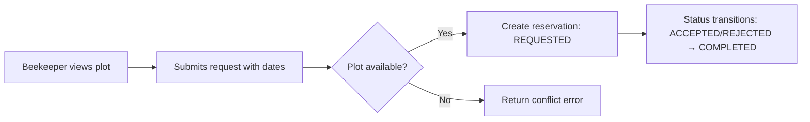

# 🎓 Thesis Project Brief: AgriBee Spatial Decision-Support Platform

> **Compact Context for Project Initialization** | *Bachelor Thesis | 4-Month Scope | Junior-Level Implementation*

---

## 📋 Executive Summary

| Attribute | Detail |
|-----------|--------|
| **Project Title** | Web Application for Identifying Optimal Agricultural Plots for Beehive Placement |
| **Core Purpose** | Geospatial decision-support system connecting beekeepers to agricultural plots based on pollination potential |
| **Primary User** | Beekeepers only (farmer role mocked in data, no UI/flows) |
| **Geographic Focus** | Northern Evoia, Greece (expandable) |
| **Tech Stack** | ASP.NET Core Web API + PostgreSQL/PostGIS + React/Blazor + Leaflet/OpenStreetMap |
| **Thesis Emphasis** | Geospatial integration, PostGIS querying, distributed data pipeline, explainable scoring |

---

## 🎯 Functional Scope (Strict Boundaries)

### ✅ In-Scope Flows
1. User registration & login (beekeeper role only)
2. Interactive map visualization of agricultural plots (GeoJSON polygons)
3. Plot detail view with metadata (size, location, crop type, optional pollen index)
4. Beekeeper submits hive placement request for a plot
5. View reservation status: `REQUESTED` → `ACCEPTED`/`REJECTED` → `COMPLETED`

### 🔶 Optional (Feasibility-Dependent)
- Pollen health dashboard (data via backend scheduler, not user-triggered)
- Simple suitability score: `pollen_index × plot_size × flowering_overlap` (explainable formula only)
- Mock payment flow or SMTP notification prototype

### ❌ Explicitly Out-of-Scope
- Farmer-facing UI or workflows
- Real-time external API calls from frontend
- Machine learning / complex predictive models
- Plot creation/editing (import-only from Greek open geodata)
- Multi-tenant commercial features (billing, subscriptions, analytics)

---

## 🗄️ Data & Geospatial Architecture

### Data Sources
- **Primary**: Greek open geospatial datasets ([geodata.gov.gr](https://geodata.gov.gr)) → imported as GeoJSON
- **Optional**: Open-Meteo pollen API (`/forecast?hourly=pollen_grass,pollen_tree`)

### Storage & Querying
```
PostgreSQL + PostGIS (Docker-local)
├── plots: geometry (POLYGON), crop_type, flowering_period, farmer_id (mock)
├── users: beekeeper profiles
├── requests: plot_id, user_id, date_range, status
├── pollen_cache: lat, lng, timestamp, grass/tree pollen values
└── Spatial indexes: GiST on geometry for bbox/intersection queries
```

### Required API Endpoints (REST)
```
GET  /plots?bbox=minLng,minLat,maxLng,maxLat&page=1&limit=20
GET  /plots/{id}
POST /requests          # auth: beekeeper
GET  /requests          # auth: beekeeper, filter by status
GET  /reservations      # auth: beekeeper
GET  /pollen/summary    # optional, cached data only
```

### Backend Pollen Ingestion (Optional)
```
External API → ASP.NET BackgroundService (3-6h interval) → PostgreSQL
→ Frontend reads cached values only (no direct external calls)
```

---

## 🔄 Reservation Workflow


---

## 🧭 Non-Functional Requirements
| Category | Requirement |
|----------|-------------|
| **Performance** | Map viewport queries <500ms for 100 plots (PostGIS spatial index) |
| **Scalability** | Stateless API; frontend pagination; cached pollen data |
| **Security** | JWT auth; role-based access (beekeeper only); input validation |
| **Maintainability** | Clean architecture layers; documented spatial queries; explainable scoring |
| **Academic Integrity** | All logic traceable; no black-box ML; citations for scientific basis (Odoux et al., 2009) |
